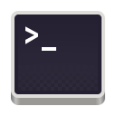
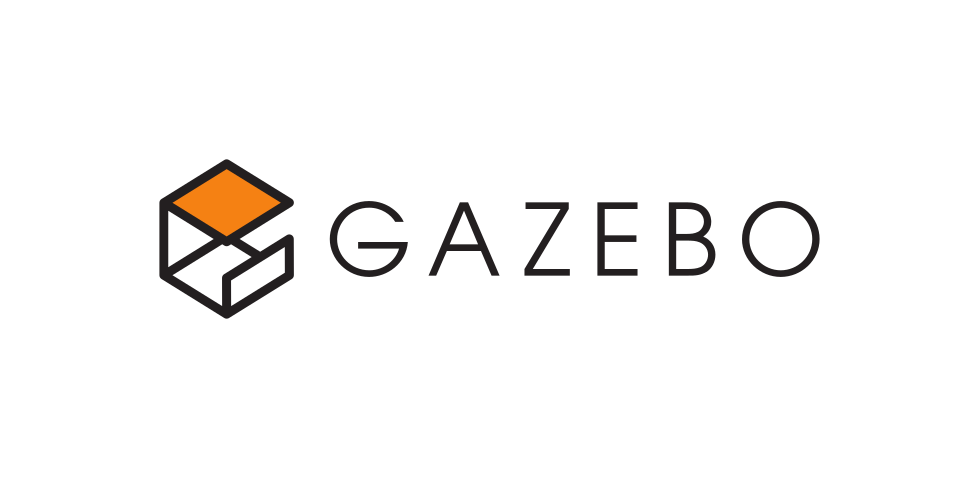

<div align="center">
<a href="https://git.io/typing-svg"></a>
</div>

```yaml
name: Muhammet Ali Aykanat
located_in: Turkiye
job: R-D Software Development Engineer
education: ["Ph.D.c in Electrical and Computer Engineering", "Bachelor's in Mechatronics Engineering"]
company: Dener Group
languages: ["Python", "C++"]
fields_of_researches: ["Machine Learning", "Deep Learning", "Computer Vision", "Image Processing", 
                      "Optimization", "Data Science"]
currently_learning: ["GPU Programming", "Tensorflow", "Pytorch"]
will_learn: ["Generative Models", "SQL"]
hobbies: ["History", "Science", "New Culture"]
```
<div align="center">
<a ></a>
</div>

## :handshake: Hit me up:
[](https://github.com/MAAykanat/)
[](https://www.linkedin.com/in/muhammet-ali-aykanat/)
[](mailto:m.a.aykanat@gmail.com)

## :hammer_and_wrench: Tech and Tool Set:
<a href="https://www.python.org/" target="_blank"> </img> </a>
<a href="https://visualstudio.microsoft.com/vs/features/cplusplus/" target="_blank"> </img> </a>

<a href="https://www.microsoft.com/en-gb/windows" target="_blank"> </img> </a>
<a href="https://kernel.org/" target="_blank"> </img> </a>
<a href="https://www.raspberrypi.com/" target="_blank"> </img> </a>
<a href="https://www.arduino.cc/" target="_blank"> </img> </a>
<a href="https://developer.nvidia.com/cuda-toolkit" target="_blank"> </img> </a>

<a href="https://visualstudio.microsoft.com/downloads/" target="_blank"> </img> </a>
<a href="https://code.visualstudio.com/download" target="_blank"> </img> </a>
<a href="https://jupyter.org/" target="_blank"> </img> </a>
<a href="https://www.vim.org/" target="_blank"> </img> </a>
<a href="https://github.com/MAAykanat" target="_blank"> </img> </a>
<a href="https://www.gnu.org/software/bash/" target="_blank"> </img> </a>
<a href="https://github.com/MAAykanat" target="_blank"> </img> </a>
<a href="https://www.kaggle.com/muhammetaliaykanat" target="_blank"> </img> </a>

<a href="https://numpy.org/" target="_blank"> </img> </a>
<a href="https://seaborn.pydata.org/" target="_blank"> </img> </a>
<a href="https://pandas.pydata.org/" target="_blank"> </img> </a>
<a href="https://scikit-learn.org/stable/" target="_blank"> </img> </a>
<a href="https://opencv.org/" target="_blank"> </img> </a>
<a href="https://www.tensorflow.org/" target="_blank"> </img> </a>
<a href="https://keras.io/" target="_blank"> </img> </a>
<a href="https://matplotlib.org/" target="_blank"> </img> </a>

### :computer: Academic Research Level:

<a href="https://www.mathworks.com/products/matlab.html" target="_blank"> </img> </a>
<a href="https://www.r-project.org/" target="_blank"> </img> </a>
<a href="https://www.wolfram.com/mathematica/" target="_blank"> </img> </a>
<a href="https://www.ros.org/" target="_blank"> </img> </a>
<a href="https://gazebosim.org/home" target="_blank"> </img> </a>
<a href="https://cmake.org/" target="_blank"> </img> </a>


<!--
**MAAykanat/MAAykanat** is a ✨ _special_ ✨ repository because its `README.md` (this file) appears on your GitHub profile.
