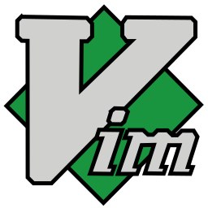

<div align="center">
<a href="https://git.io/typing-svg"></a>
</div>

```yaml
name: Muhammet Ali Aykanat
located_in: Turkiye
job: R-D Software Development Engineer
education: ["Ph.D.c in Electrical and Computer Engineering", "Bachelor's in Mechatronics Engineering"]
company: Dener Group
languages: ["Python", "C++"]
fields_of_researches: ["Machine Learning", "Deep Learning", "Computer Vision", "Image Processing", 
                      "Optimization", "Data Science"]
currently_learning: ["GPU Programming", "Tensorflow", "Pytorch"]
will_learn: ["Generative Models", "SQL"]
hobbies: ["History", "Science", "New Culture"]
```
<div align="center">
<a ></a>
</div>

## :handshake: Hit me up:
[](https://github.com/MAAykanat/)
[](https://www.linkedin.com/in/muhammet-ali-aykanat/)
[](mailto:m.a.aykanat@gmail.com)

## :hammer_and_wrench: Tech and Tool Set:
</img> 
</img>

</img>
</img>
</img>
</img>
</img>


</img>
</img>
</img>
</img>
</img>
</img>
</img>
</img>


</img>
</img>
</img>
</img>
</img>
</img>
</img>

### :computer: Academic Research Level:

</img>
</img>
</img>
</img>
</img>


<!--
**MAAykanat/MAAykanat** is a ✨ _special_ ✨ repository because its `README.md` (this file) appears on your GitHub profile.
